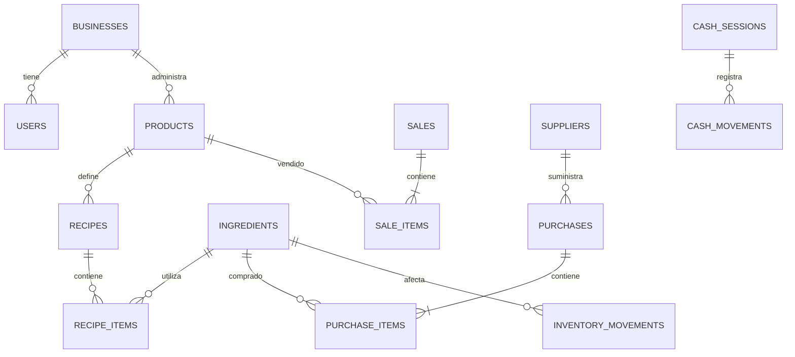
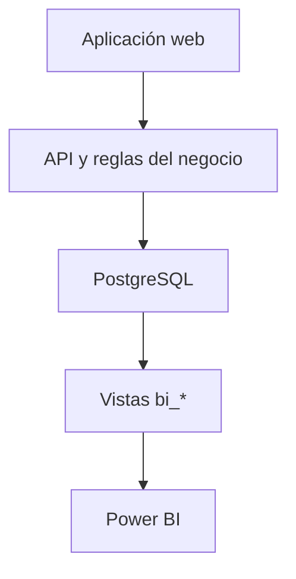

# Café Control — Especificación del MVP

**Versión:** 1.0  
**Fecha:** 23 de julio de 2026  
**Producto:** Aplicación web para el control operativo y financiero de una cafetería  
**Usuario inicial:** Propietario o administrador de una sola cafetería  
**Moneda inicial:** Quetzales (GTQ)  
**Idioma inicial:** Español

---

## 1. Resumen

Café Control será una aplicación web para registrar y consultar ventas, productos, recetas, ingredientes, compras, inventario, mermas, gastos y cierres de caja.

El MVP debe reemplazar el uso de múltiples hojas de cálculo con una única fuente de información almacenada en PostgreSQL. La estructura se diseñará para que Power BI pueda conectarse directamente a la base de datos y construir reportes adicionales sin duplicar ni transformar manualmente la información.

El producto se enfocará en tres resultados:

1. Registrar una operación habitual en menos de 30 segundos.
2. Conocer ventas, costos, utilidad, caja e inventario desde un único panel.
3. Mantener datos ordenados y relacionados para análisis en Power BI.

---

## 2. Problema que resuelve

Una cafetería pequeña suele registrar ventas, compras, gastos e inventario en archivos separados. Esto provoca:

- Duplicación de información.
- Nombres diferentes para un mismo producto o ingrediente.
- Dificultad para calcular el costo real de las recetas.
- Diferencias entre inventario teórico y físico.
- Poca visibilidad de la utilidad real.
- Cierres de caja difíciles de comprobar.
- Trabajo adicional antes de usar Power BI.

Café Control centralizará esas operaciones y aplicará reglas de validación desde el momento del ingreso.

---

## 3. Alcance del MVP

### Incluido

| Módulo | Capacidad principal |
|---|---|
| Panel | Mostrar ventas, utilidad estimada, ticket promedio, caja e inventario crítico |
| Ventas | Crear, consultar, anular y filtrar ventas |
| Productos | Administrar el menú, precios, categorías y estado |
| Recetas | Relacionar productos con ingredientes y calcular costo teórico |
| Ingredientes | Administrar unidades, existencias mínimas y costos |
| Compras | Registrar compras y actualizar inventario |
| Proveedores | Crear y consultar proveedores |
| Inventario | Consultar existencias, movimientos, conteos y ajustes |
| Mermas | Registrar desperdicios, vencimientos y errores de preparación |
| Gastos | Registrar gastos fijos y variables |
| Caja | Abrir turno, registrar movimientos y realizar cierre |
| Reportes | Filtrar información y exportar CSV |
| Power BI | Permitir conexión de lectura a PostgreSQL mediante vistas analíticas |

### Fuera del MVP

- Facturación electrónica o emisión de DTE.
- Contabilidad fiscal completa.
- Cálculo de planilla y prestaciones.
- Aplicación móvil nativa.
- Programa de fidelización.
- Pedidos en línea para clientes.
- Integraciones con aplicaciones de delivery.
- Administración de varias sucursales.
- Pronósticos con inteligencia artificial.
- Compras automáticas a proveedores.
- Funcionamiento sin conexión a internet.

Estos puntos podrán añadirse sin modificar la estructura central del producto.

---

## 4. Dirección visual

La interfaz seguirá el lenguaje visual de la imagen de referencia proporcionada: un panel administrativo monocromático, editorial y ordenado, con alta densidad de información pero sin sensación de saturación.

### 4.1 Rasgos observados en la referencia

- Navegación lateral blanca y fija.
- Área principal separada mediante un cambio leve de fondo.
- Encabezado horizontal con búsqueda, filtros y una acción primaria oscura.
- Panel de resumen en tono marfil muy claro.
- Métricas grandes con poco ornamento.
- Gráficos principalmente negros, grises y tramados.
- Tarjetas con fondo blanco, bordes delgados y sombra mínima.
- Uso puntual de tarjetas negras para selección o énfasis.
- Iconos lineales simples.
- Tipografía sans serif geométrica y limpia.
- Esquinas redondeadas moderadas.
- Espaciado generoso entre bloques y espaciado compacto dentro de cada tarjeta.

La aplicación no copiará la distribución del CRM mostrado. Adoptará su sistema visual y lo adaptará a las operaciones de una cafetería.

### 4.2 Tokens visuales

| Token | Valor propuesto | Uso |
|---|---|---|
| Fondo principal | `#FFFFFF` | Navegación y tarjetas |
| Fondo secundario | `#F7F7F0` | Panel de resumen y filtros |
| Fondo suave | `#F4F4F4` | Estados activos y filas alternas |
| Texto principal | `#1B1B1B` | Títulos, métricas y acciones |
| Texto secundario | `#6F6F6A` | Ayudas, etiquetas y metadatos |
| Borde | `#DEDED9` | Tarjetas, campos y divisiones |
| Acción primaria | `#1C1C1C` | Botones principales y selección |
| Acción primaria hover | `#343434` | Interacción |
| Éxito | `#3A8F63` | Caja correcta y variaciones positivas |
| Advertencia | `#C68B2C` | Inventario bajo |
| Error | `#B94A48` | Faltantes, anulaciones y vencimientos |

Los colores de estado deben ocupar menos del 10% de la interfaz. El producto se mantendrá predominantemente monocromático.

### 4.3 Tipografía y componentes

- **Tipografía:** Inter, Geist o Manrope.
- **Títulos de página:** 28–32 px, peso 600.
- **Títulos de sección:** 18–22 px, peso 600.
- **Texto de interfaz:** 14–16 px.
- **Métricas:** 32–44 px, peso 500–600 y números tabulares.
- **Radio de tarjetas:** 12 px.
- **Radio de campos y botones:** 10 px.
- **Borde:** 1 px sólido.
- **Sombras:** suaves y únicamente cuando ayuden a separar capas.
- **Altura mínima de controles:** 40 px.
- **Iconos:** lineales, 18–22 px.

### 4.4 Estructura general

La aplicación tendrá:

1. Una barra lateral fija.
2. Una barra superior con búsqueda, período y acción principal.
3. Un bloque de indicadores.
4. Un área de trabajo con tablas, formularios o tarjetas.

La navegación lateral contendrá:

- Resumen
- Ventas
- Productos
- Recetas
- Inventario
- Compras
- Gastos
- Caja
- Reportes
- Configuración

En pantallas pequeñas la barra lateral se convertirá en un menú desplegable. Las tablas permitirán desplazamiento horizontal sin comprimir columnas críticas.

---

## 5. Roles y seguridad

### Rol del MVP: Propietario

Puede:

- Ver toda la información.
- Crear y editar catálogos.
- Registrar operaciones.
- Anular ventas.
- Ajustar inventario.
- Realizar cierres de caja.
- Exportar información.

El sistema se diseñará para agregar posteriormente los roles `Administrador`, `Cajero` y `Consulta`.

### Requisitos mínimos de seguridad

- Inicio de sesión con correo y contraseña.
- Contraseñas almacenadas únicamente como hash seguro.
- Sesiones con vencimiento.
- Registro de quién creó, modificó o anuló operaciones.
- Variables de conexión y secretos fuera del repositorio.
- Usuario independiente de solo lectura para Power BI.
- Operaciones financieras eliminadas mediante anulación lógica, no mediante borrado físico.

---

## 6. Experiencia principal

### 6.1 Panel de resumen

La primera pantalla mostrará:

#### Indicadores

- Ventas del período.
- Utilidad bruta estimada.
- Margen bruto.
- Ticket promedio.
- Número de ventas.
- Efectivo esperado en caja.
- Valor estimado del inventario.
- Cantidad de ingredientes bajo mínimo.

#### Visualizaciones

- Ventas por día.
- Ventas por categoría.
- Productos más vendidos.
- Productos con mayor margen.
- Compras y gastos del período.
- Alertas de inventario.
- Diferencias recientes de caja.

#### Composición visual

El encabezado superior tendrá búsqueda, selector de período y el botón oscuro `Registrar venta`.

Debajo se mostrará un panel marfil con:

- Gráfico de barras de ventas de la semana.
- Indicador semicircular del margen bruto.
- Número de transacciones.
- Total de utilidad bruta.

La parte inferior mostrará dos bloques:

- Ventas recientes.
- Inventario crítico.

Una tarjeta seleccionada o una alerta importante podrá utilizar fondo negro, siguiendo el énfasis visual de la referencia.

### 6.2 Registrar venta

Flujo:

1. Pulsar `Registrar venta`.
2. Buscar o seleccionar productos.
3. Indicar cantidad y modificadores.
4. Aplicar descuento, si corresponde.
5. Elegir método de pago.
6. Confirmar total.
7. Guardar venta.

Al confirmar:

- Se crean la venta y sus líneas.
- Se guarda el precio histórico.
- Se calcula el costo teórico.
- Se descuentan ingredientes según la receta.
- Se registra el movimiento de inventario.
- Se actualiza la caja si el método de pago es efectivo.

El formulario deberá completarse con teclado y permitir agregar varias unidades rápidamente.

### 6.3 Compras

Flujo:

1. Seleccionar proveedor.
2. Ingresar fecha y número de documento.
3. Agregar ingredientes comprados.
4. Indicar cantidad, presentación y precio.
5. Registrar impuesto y forma de pago.
6. Confirmar recepción.

Al confirmar:

- Se actualiza el costo de compra.
- Se incrementa el inventario.
- Se crean movimientos de inventario.
- Se conserva el costo histórico.

### 6.4 Inventario

Debe permitir:

- Consultar existencias actuales.
- Filtrar ingredientes bajo mínimo.
- Ver historial de movimientos.
- Registrar un conteo físico.
- Registrar una merma.
- Realizar un ajuste con motivo obligatorio.

El sistema mostrará por separado:

- Existencia teórica.
- Existencia física del último conteo.
- Diferencia.
- Valor monetario de la diferencia.

### 6.5 Gastos

Formulario rápido con:

- Fecha.
- Categoría.
- Proveedor o beneficiario.
- Descripción.
- Subtotal.
- Impuesto.
- Total.
- Método de pago.
- Estado de pago.
- Comprobante opcional en una fase posterior.

### 6.6 Caja

Flujo diario:

1. Abrir caja con fondo inicial.
2. Registrar ventas y movimientos del turno.
3. Registrar retiros o ingresos extraordinarios.
4. Contar efectivo al cierre.
5. Comparar efectivo esperado contra contado.
6. Confirmar diferencia y observación.

Una caja cerrada no se editará. Cualquier corrección deberá quedar registrada como ajuste.

---

## 7. Reglas del negocio

1. Todo producto, ingrediente, proveedor y usuario tendrá un identificador único.
2. Los registros desactivados permanecerán disponibles en el historial.
3. Una venta confirmada conservará su precio, descuento y costo aunque el catálogo cambie después.
4. Una compra conservará el costo unitario recibido.
5. Las cantidades de inventario se almacenarán en una unidad base.
6. Cada ingrediente podrá definir una conversión desde su presentación de compra.
7. Una venta solo descontará inventario si el producto tiene receta activa.
8. Ningún ajuste de inventario podrá guardarse sin motivo.
9. Las ventas y operaciones de caja no se borrarán; se anularán.
10. La diferencia de caja será `efectivo contado - efectivo esperado`.
11. El costo teórico de un producto será la suma del costo de sus ingredientes y empaques.
12. La utilidad bruta estimada será `venta neta - costo teórico`.
13. Los impuestos se almacenarán separados del subtotal.
14. Los importes se almacenarán con precisión decimal, nunca como números de punto flotante.

---

## 8. Modelo de datos SQL

La base de datos será PostgreSQL. Todos los identificadores principales utilizarán UUID, los importes `NUMERIC(14,2)`, las cantidades `NUMERIC(14,3)` y las fechas operativas `TIMESTAMPTZ`.

### 8.1 Tablas

| Tabla | Propósito | Campos principales |
|---|---|---|
| `businesses` | Configuración del negocio | `id`, `name`, `currency`, `timezone`, `tax_rate` |
| `users` | Acceso y auditoría | `id`, `business_id`, `name`, `email`, `password_hash`, `role`, `active` |
| `product_categories` | Clasificar menú | `id`, `business_id`, `name`, `active` |
| `products` | Productos vendidos | `id`, `category_id`, `sku`, `name`, `sale_price`, `tax_included`, `active` |
| `ingredient_categories` | Clasificar insumos | `id`, `business_id`, `name` |
| `ingredients` | Ingredientes y empaques | `id`, `category_id`, `sku`, `name`, `base_unit`, `minimum_stock`, `active` |
| `recipes` | Encabezado de receta | `id`, `product_id`, `version`, `yield_quantity`, `active` |
| `recipe_items` | Ingredientes de receta | `id`, `recipe_id`, `ingredient_id`, `quantity`, `waste_percentage` |
| `suppliers` | Proveedores | `id`, `business_id`, `name`, `tax_id`, `phone`, `email`, `active` |
| `sales` | Encabezado de venta | `id`, `business_id`, `sale_number`, `sold_at`, `status`, `payment_method`, `subtotal`, `discount_total`, `tax_total`, `total`, `user_id` |
| `sale_items` | Detalle de venta | `id`, `sale_id`, `product_id`, `quantity`, `unit_price`, `discount`, `tax`, `line_total`, `unit_cost_snapshot` |
| `purchases` | Encabezado de compra | `id`, `supplier_id`, `document_number`, `purchased_at`, `payment_status`, `subtotal`, `tax_total`, `total`, `user_id` |
| `purchase_items` | Detalle de compra | `id`, `purchase_id`, `ingredient_id`, `purchase_quantity`, `purchase_unit`, `base_quantity`, `unit_cost`, `unit_price`, `line_total`, `expires_at` |
| `inventory_movements` | Kardex de inventario | `id`, `ingredient_id`, `occurred_at`, `movement_type`, `quantity_delta`, `unit_cost`, `reference_type`, `reference_id`, `reason`, `user_id` |
| `inventory_counts` | Encabezado de conteo | `id`, `business_id`, `counted_at`, `status`, `user_id`, `notes` |
| `inventory_count_items` | Resultado de conteo | `id`, `count_id`, `ingredient_id`, `theoretical_quantity`, `physical_quantity`, `difference_quantity`, `unit_cost` |
| `expenses` | Gastos operativos | `id`, `business_id`, `expense_date`, `category`, `description`, `supplier_id`, `subtotal`, `tax_total`, `total`, `payment_method`, `payment_status`, `user_id` |
| `cash_sessions` | Apertura y cierre | `id`, `business_id`, `opened_at`, `closed_at`, `opening_amount`, `expected_amount`, `counted_amount`, `difference_amount`, `status`, `opened_by`, `closed_by` |
| `cash_movements` | Ingresos y retiros | `id`, `cash_session_id`, `occurred_at`, `movement_type`, `amount`, `reason`, `user_id` |
| `audit_log` | Historial de cambios | `id`, `business_id`, `user_id`, `action`, `entity_type`, `entity_id`, `occurred_at`, `before_data`, `after_data` |

### 8.2 Relaciones

### 8.3 Restricciones esenciales

- `sku` será único dentro del negocio.
- `sale_number` será único dentro del negocio.
- Precios, costos y cantidades no podrán ser negativos.
- `quantity_delta` será positivo para entradas y negativo para salidas.
- `sale_items` conservará precio y costo histórico.
- Una receta solo podrá tener una versión activa por producto.
- Las claves foráneas operativas no usarán eliminación en cascada.
- Todas las tablas tendrán `created_at` y `updated_at`.
- Los registros de catálogo tendrán `active` en lugar de eliminación física.

---

## 9. Vistas para Power BI

Power BI no debe consultar directamente todas las tablas operativas. La base incluirá vistas estables y de solo lectura:

| Vista | Contenido |
|---|---|
| `bi_sales_detail` | Fecha, venta, producto, categoría, cantidad, ingresos, descuentos, impuestos y costo |
| `bi_daily_sales` | Ventas, costos, utilidad y tickets por día |
| `bi_product_profitability` | Cantidad, ingresos, costo, utilidad y margen por producto |
| `bi_purchase_detail` | Compras por fecha, proveedor e ingrediente |
| `bi_inventory_current` | Existencia, costo promedio, valor y estado mínimo |
| `bi_inventory_movements` | Entradas, salidas, mermas y ajustes |
| `bi_expenses` | Gastos por fecha y categoría |
| `bi_cash_closures` | Aperturas, cierres y diferencias |
| `bi_profit_and_loss_monthly` | Ventas, costo de ventas, utilidad bruta, gastos y resultado operativo mensual |

### Conexión

- Power BI Desktop podrá conectarse con el conector de PostgreSQL.
- Para una base en la nube se utilizará un usuario de lectura restringido a las vistas `bi_*`.
- Si la base permanece en una red local y se requiere actualización programada desde Power BI Service, deberá instalarse y configurarse un gateway de datos.
- El MVP también permitirá exportar las vistas principales a CSV como alternativa de respaldo.

Fuentes técnicas:

- [Conector PostgreSQL de Power Query](https://learn.microsoft.com/en-us/power-query/connectors/postgresql)
- [Gateway de datos local de Power BI](https://learn.microsoft.com/en-us/power-bi/connect-data/service-gateway-onprem)

---

## 10. Arquitectura propuesta

### Aplicación

- **Frontend:** React con TypeScript.
- **Framework web:** Next.js o equivalente con renderizado del lado del servidor.
- **Backend:** API dentro de la misma aplicación durante el MVP.
- **Base de datos:** PostgreSQL.
- **Acceso a datos:** ORM con migraciones versionadas.
- **Validación:** esquema compartido entre formularios y API.
- **Autenticación:** sesión segura con correo y contraseña.
- **Gráficos:** librería de gráficos accesible y responsiva.
- **Despliegue:** contenedores o plataforma web compatible con PostgreSQL.

### Ambientes

| Ambiente | Propósito |
|---|---|
| Desarrollo | Programación y pruebas con datos ficticios |
| Producción | Aplicación web y base de datos real |

La dirección de la base de datos se definirá mediante una variable `DATABASE_URL`, permitiendo cambiar de un PostgreSQL local a uno alojado en la nube sin modificar el modelo.

### Capas

---

## 11. API mínima

| Método | Ruta | Función |
|---|---|---|
| `GET` | `/api/dashboard` | Obtener indicadores del período |
| `GET/POST` | `/api/products` | Consultar y crear productos |
| `PATCH` | `/api/products/:id` | Editar o desactivar producto |
| `GET/POST` | `/api/ingredients` | Consultar y crear ingredientes |
| `GET/POST` | `/api/recipes` | Consultar y crear recetas |
| `GET/POST` | `/api/sales` | Consultar y registrar ventas |
| `POST` | `/api/sales/:id/void` | Anular una venta |
| `GET/POST` | `/api/purchases` | Consultar y registrar compras |
| `GET/POST` | `/api/expenses` | Consultar y registrar gastos |
| `GET` | `/api/inventory` | Consultar existencias |
| `POST` | `/api/inventory/counts` | Registrar conteo físico |
| `POST` | `/api/inventory/adjustments` | Registrar ajuste o merma |
| `POST` | `/api/cash/open` | Abrir caja |
| `POST` | `/api/cash/movement` | Registrar ingreso o retiro |
| `POST` | `/api/cash/close` | Cerrar caja |
| `GET` | `/api/exports/:report.csv` | Descargar reporte autorizado |

Las operaciones que afecten ventas, inventario o caja se ejecutarán dentro de transacciones de base de datos.

---

## 12. Estados vacíos, validaciones y errores

### Estados vacíos

La aplicación deberá explicar el siguiente paso:

- Sin ventas: `Registra tu primera venta para comenzar a ver resultados`.
- Sin productos: `Crea el menú de tu cafetería`.
- Sin recetas: `Agrega ingredientes para calcular el costo real`.
- Sin inventario: `Registra una compra o un inventario inicial`.

### Validaciones

- Campos obligatorios claramente identificados.
- Mensajes junto al campo correspondiente.
- Confirmación antes de anular una venta o cerrar caja.
- Advertencia si un producto no tiene receta.
- Advertencia si una compra usa una unidad sin conversión.
- Prevención de doble envío al guardar.
- Indicador visible durante operaciones en proceso.

### Accesibilidad

- Navegación completa con teclado.
- Contraste mínimo AA.
- Etiquetas para campos e iconos.
- Estados que no dependan únicamente del color.
- Foco visible.
- Tablas con encabezados semánticos.
- Respeto a preferencias de reducción de movimiento.

---

## 13. Criterios de aceptación

El MVP se considerará funcional cuando:

1. El propietario pueda iniciar sesión.
2. Pueda crear categorías, productos, ingredientes y recetas.
3. El costo de una receta se calcule a partir de los costos de ingredientes.
4. Pueda registrar una venta con varios productos.
5. La venta descuente automáticamente los ingredientes correspondientes.
6. Pueda registrar una compra y aumentar inventario.
7. Pueda registrar un gasto.
8. Pueda registrar merma y conteo físico.
9. Pueda abrir y cerrar una caja mostrando la diferencia.
10. El panel responda a un filtro de fechas.
11. Los totales del panel coincidan con las operaciones registradas.
12. Las operaciones anuladas no se incluyan en ventas netas.
13. Las vistas `bi_*` entreguen información consistente.
14. Power BI pueda leer las vistas con un usuario de solo lectura.
15. Los reportes principales puedan descargarse como CSV.
16. La interfaz sea utilizable en computadora y tableta.

---

## 14. Datos de demostración

El ambiente inicial incluirá:

- 20 productos.
- 30 ingredientes e insumos.
- 20 recetas.
- 5 proveedores.
- 60 días de ventas.
- 20 compras.
- 25 gastos.
- 4 conteos de inventario.
- 30 cierres de caja.

Los datos ficticios permitirán validar gráficos, filtros, márgenes, inventario y conexión con Power BI antes de utilizar información real.

---

## 15. Orden de implementación

### Fase 1 — Base

- Autenticación.
- Estructura visual.
- Modelo SQL y migraciones.
- Catálogos de productos, ingredientes y proveedores.

### Fase 2 — Operación

- Recetas y costos.
- Ventas.
- Compras.
- Movimientos de inventario.

### Fase 3 — Control

- Gastos.
- Conteos y mermas.
- Apertura y cierre de caja.
- Panel de indicadores.

### Fase 4 — Analítica

- Vistas `bi_*`.
- Exportación CSV.
- Pruebas de conexión con Power BI.
- Validación de consistencia de cifras.

---

## 16. Indicadores de éxito

Durante el primer mes de uso se buscará:

- Registrar al menos el 95% de las ventas.
- Registrar cada compra el mismo día.
- Reducir a menos de 10 minutos el cierre diario.
- Tener receta y costo para al menos el 90% de los productos activos.
- Identificar semanalmente diferencias de inventario.
- Obtener ventas, costo y utilidad mensual sin consolidación manual.

---

## 17. Decisiones pendientes antes del desarrollo

Estas decisiones no bloquean la definición del MVP, pero deberán confirmarse al iniciar la implementación:

1. Nombre comercial y logotipo de la cafetería.
2. Tasa y tratamiento de impuestos definidos con el contador.
3. Métodos de pago utilizados.
4. Unidades de medida permitidas.
5. Política de descuentos y anulaciones.
6. Si el precio del menú incluye impuestos.
7. Proveedor de alojamiento web y PostgreSQL.
8. Frecuencia deseada de actualización de Power BI.

---

## 18. Resultado esperado

El MVP entregará una aplicación web sencilla, rápida y visualmente consistente con la referencia: monocromática, espaciosa, con navegación lateral, métricas claras y tarjetas de bordes ligeros.

La información operativa quedará centralizada en PostgreSQL y preparada para evolucionar hacia varias sucursales, más usuarios, integraciones externas y análisis avanzados en Power BI.
